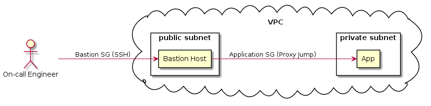

Overview
========

In this blog post, we are going to talk about what is Bastion Host and why do we need one. Afterward, we are going to deploy a proof of concept using AWS CloudFormation.


Bastion Who?
============

Although [toil](https://cloud.google.com/blog/products/management-tools/identifying-and-tracking-toil-using-sre-principles) is highly discouraged, sometimes we need to _ssh_ into an instance in order to do some kind of debugging. As a result, we need to expose that instance to the whole internet and that is _no bueno_. One way to prevent this from happening is to implement a Bastion Host.

> A bastion host is a server whose purpose is to provide access to a private network from an external network, such as the Internet.

Why do we need one?
===================

The idea of implementing this is being able to reduce the attack surface of our  
infrastructure by doing 2 things:

1.  Removing the application instances (could also be a database instance) or other servers that are not meant to be open to the world.
2.  Being able to harden one machine (the bastion) and not  
    each and every other server in our infrastructure. So, in this case, the m̶o̶r̶e̶ less the merrier.

Another benefit that the Bastion Host can have is logging in order to prevent  
[repudiation](https://searchsecurity.techtarget.com/definition/nonrepudiation). This works because engineers have their own key pair. As a result, you can keep track of what Alice and Bob did during their last session.

What are we going to deploy?
============================



Project Overview

The idea is that our on-call engineer will _ssh_ her way into the App Instance via Bastion Host. In order to replicate this setup, we need to deploy 15+ AWS resources, but let’s focus on the ones that are in the diagram:

VPC
---

We need one so we can create the virtual network where our instances will run

Private Subnet
--------------

We need a network that can only receive internal traffic (we only need a private IP address)

Public Subnet
-------------

We need a network that can receive traffic from the Internet (we need a public IP address)

**Bastion Security Group (SG)**
-------------------------------

We need it to make sure the Bastion Host Instance can receive traffic from port 22 (SSH).

Application SG
--------------

We need to make sure our App Instance can receive traffic from our Bastion Host SG.

Bastion Host (EC2)
------------------

We need a server that we can use as a Bastion Host

App Instance (EC2)
------------------

We need a server that is not exposed to the internet

Getting Started
===============

You can find the relevant files in [GitHub](https://github.com/shekodn/bastion-poc).

Prerequisites
-------------

*   Make sure you have an AWS account
*   Make sure you have a user with the appropriate roles
*   [Create a key pair](https://docs.aws.amazon.com/AWSEC2/latest/UserGuide/ec2-key-pairs.html#having-ec2-create-your-key-pair) in the _us-east-1_ availability zone. We will use the keys to connect to our instance.

main.yml
--------

We can divide this file into 3 sections:

*   **Parameters**: Where we import variables from _deploy.sh_ (more about it coming next) so we can use them with our resources’ attributes.
*   **Resources**: Where we define all the AWS resources that we need for this setup.
*   **Output**: If everything goes according to plan, we want to import the IP addresses from our created instances.

Remember: Although this is a simple setup, we need at least 15 AWS resources to make the desired implementation work. For example, we need an Internet Gateway so our Bastion Instance can talk to the internet and we need a Route Table to direct network traffic.

Set up the vars
---------------

```
# deploy.sh
STACK_NAME=bastion-poc  
REGION=us-east-1  
CLI_PROFILE=<your-aws-profile-with-an-appropiate-role>  
EC2_INSTANCE_TYPE=t2.micro  
KEY_NAME=<your-key-pair-name>
```

Run the deployment script
-------------------------

In this script, we set up our credentials and we run a command to deploy the _main.yml_ template to AWS. If everything goes well, you should expect 2 IP addresses: One from the Bastion Instance (public) and one from the App instance (private).

Go to your terminal and run the following:

```
./deploy.sh
```

_Note: If you want to debug or see what happened, go to the respective  
CloudFormation stack in the AWS console._

Config your ssh config file
---------------------------

Now that we have our implementation we are ready to pray to the demo gods and test our implementation. But before _ssh’ing_ anywhere, we need to do one more thing.

Go to _~/.ssh/config_ and add the following hosts:

```
...

### The Bastion Host  
Host bastion-host-poc  
 HostName <public-ip-from-output>  
 User ec2-user  
 Port 22  
 IdentityFile ~/.ssh/<your-key-pair-private-key>\### The App Host  

### The App Host  
Host app-host-poc  
 HostName <private-ip-from-output>  
 User ec2-user  
 IdentityFile ~/.ssh/<your-key-pair-private-key>  
 ProxyJump bastion-host-poc
```

SSH’ing your way in
-------------------

If everything went well (and if we prayed to the demo gods) we should be able to
_ssh_ to the App Instance.

Go to your terminal and _ssh_ into it:

```
ssh app-host-poc
```

Voilà. You are inside a machine that is running in a private subnet. Isn’t it  
cool?

Wrapping it up
==============

Remember, this is just a Proof of Concept. For example, the Application Instance
can still send traffic to the whole world (do you really want that?). Similarly,
the Bastion Instance has yet to be hardened.

Implementing a Bastion can be useful for your current processes, especially if  
you have some instances exposed to the world and/or you want to control  
who can _ssh_ into your infrastructure.

Although you probably have a more sophisticated setup, a Bastion Host might be
the right solution for you, and this could be the kickstart of your
implementation.

_Also published on [Medium](https://medium.com/@sergiodn/deploying-a-bastion-host-in-aws-using-cloudformation-47d436826ae7)._

Resources
---------

[Amazon EC2 key pairs and Linux instances](https://docs.aws.amazon.com/AWSEC2/latest/UserGuide/ec2-key-pairs.html#having-ec2-create-your-key-pair)

[How to Record SSH Sessions Established Through a Bastion Host](https://aws.amazon.com/blogs/security/how-to-record-ssh-sessions-established-through-a-bastion-host/)

Diagrams were made using: [https://www.planttext.com/](https://www.planttext.com/)
